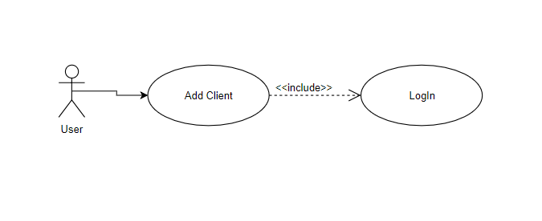

# FrontDeskBankApp_WPF

# Analysis and Design Document

# Requirement analysis

## Assignment Specification
Use JAVA/C# API to design and implement an application for the front desk employees of a bank. The application should have two types of users (a regular user represented by the front desk employee and an administrator user) which have to provide a username and a password in order to use the application.

The regular user can perform the following operations:
- Add/update/view client information (name, identity card number, personal numerical code, address, etc.).
- Create/update/delete/view client account (account information: identification number, type, amount of money, date of creation).
- money between accounts.
- Process utilities bills.

The administrator user can perform the following operations:
- CRUD on employees’ information.
- Generate reports for a particular period containing the activities performed by an employee.

## Function requirements
The data will be stored in a database. Use the Layers architectural pattern to organize your application. Use a domain logic pattern (transaction script) and a data source pure pattern (table data gateway).

## Non-functional Requirements
### Availability
The application could stop functioning if the database is deleted or corrupted or the .NET framework is uninstalled.

### Performance
Performance defines the number of operations that can be made by the system in a given amount of time. Performance could be affected if the user loads resources with other application.

### Security
Security is the attribute that guarantees that the application and its data is secure from any potential attacker. The user should have an antivirus software installed that will protect the data.

### Usability
Usability is the ease of use of the application. The application is very easy to use, the user must have basic copmuter knowledge.

# Use-Case Model

## Use case 1

    * Use case: user/employee logs into the application
    * Level: one of: sub-function
    * Primary actor: user/employee
    * Main success scenario: user enters username/idEmployee and password into the login form, clicks login and logs into the app with success
    * Extensions: user enters wrong username or password and gets a warning that a wrong username or password was entered

## Use case 2

    * Use case: user/employee adds a client into the application
    * Level: one of: sub-function
    * Primary actor: user/employee
    * Main success scenario: a user adds a client into the application by completing all required fields

## Use case 3

    * Use case: admin adds an employee into the application
    * Level: one of: sub-function
    * Primary actor: admin
    * Main success scenario: an admin adds an employee into the application by completing all required fields
    * Extensions: an admin tries to add an employee without completing all the required fields. In this case warning messages will pop-up and the admin will not be able to add the employee into the application.

# System Architectural Design

## Architectural Pattern Description
Layered architecture focuses on the grouping of related functionality within an application into distinct layers that are stacked vertically on top of each other. Functionality within each layer is related by a common role or responsibility. Communication between layers is explicit and loosely coupled. Layering your application appropriately helps to support a strong separation of concerns that, in turn, supports flexibility and maintainability.

## Diagrams
Layers architecture contains three big layers: PL, BL, DAL:

The deployment and component diagrams :

# UML Sequence Diagrams
A sequence diagram for a login scenario(user must be an employee to have a successful login):

# Class Design

## Design Patterns Description
### Transaction Script
Organizes business logic by procedures where each procedure handles a single request from the presentation.
A Transaction Script organizes all this logic primarily as a single procedure, making calls directly to the database or through a thin database wrapper. Each transaction will have its own Transaction Script, although common subtasks can be broken into subprocedures.

### Table Data Gateway
An object that acts as a Gateway to a database table. One instance handles all the rows in the table.
A Table Data Gateway holds all the SQL for accessing a single table or view: selects, inserts, updates, and deletes. Other code calls its methods for all interaction with the database.

## UML Class Diagram
The application is structured in a WPF project (PL), and two class libraries (BL, DAL). PL starts the app with the Login page and from there the app goes in two directions: UserWorkspace and AdminWorkspace. In every page a user or an admin object will be created in order to call methods. Evrey method in user/admin will create a new object Gateway. 

# Data Model

# Bibliography
- [Catalog of Patterns](https://martinfowler.com/eaaCatalog/)
- [online diagram drawing software](https://www.draw.io)

